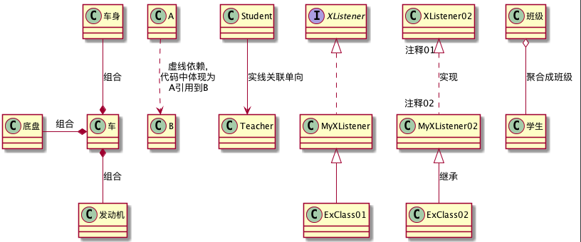
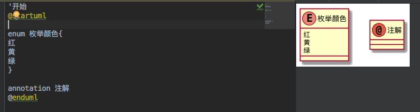
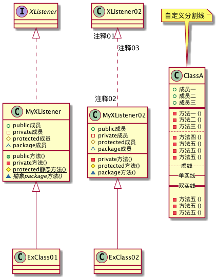
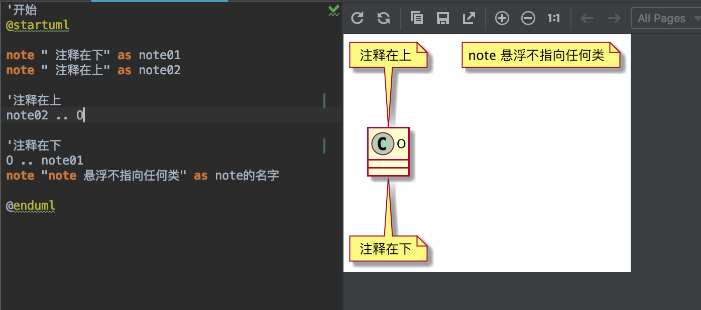
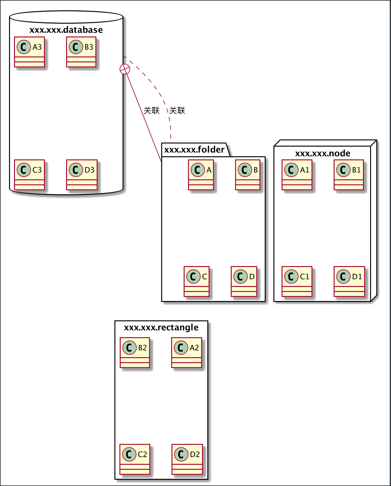

###  android studio 使用 plantUML插件绘制UML类图

[PlantUmlDemo](https://github.com/qingyc/PlantUmlDemo)

[详细教程](http://plantuml.com/zh/class-diagram)

[在线绘制](http://www.plantuml.com/plantuml/uml/SyfFKj2rKt3CoKnELR1Io4ZDoSa70000)


[Graphviz介绍](https://zh.wikipedia.org/wiki/Graphviz)

[DOT语言介绍](https://zh.wikipedia.org/wiki/DOT%E8%AF%AD%E8%A8%80)


安装graphviz
```
brew install graphviz
```


开始标签 ->@startuml
结束标签 ->@enduml

注释 -> `


###  1.类与类关系
```
'开始
@startuml

'可以使用 left right up down 定义方向


'01.依赖
A..>B :虚线依赖,\n代码中体现为\nA引用到B

'02 关联
Student --> Teacher :实线关联单向

'03.实现
'实现写法1
class MyXListener implements XListener{
}
'实现写法2
XListener02 "注释01" <|.. "注释02" MyXListener02 :实现


'04. 继承
'继成写法
Class ExClass01 extends MyXListener{
}
'继承写法02
MyXListener02<|--  ExClass02 :继承

'05.聚合
班级 o-- 学生 :聚合成班级

'06.组合
车 *-left-  底盘 : 组合
车 *-up-  车身 : 组合
车 *-down-  发动机 : 组合

'结束
@enduml

```



### 02.枚举注解
```

'开始
@startuml

enum 枚举颜色{
红
黄
绿
}

annotation 注解
@enduml

```


### 03.方法变量和权限修饰符

```
'开始
@startuml
'用于控制显示权限修饰符icon
'skinparam classAttributeIconSize 0

'一 实现
'实现写法1
class MyXListener implements XListener{
+  public成员
-  private成员
#  protected成员
~  package成员

+  public方法()
-  private方法()
#  {static} protected静态方法()
~ {abstract}  抽象package方法()
}
'实现写法2
XListener02 "注释01" <|.. "注释02" MyXListener02 :注释03
'权限修饰符
MyXListener02 : +  public成员
MyXListener02 : -  private成员
MyXListener02 : #  protected成员
MyXListener02 : ~  package成员
'MyXListener02 : +  public方法()
MyXListener02 : -  private方法()
MyXListener02 : #  protected方法()
MyXListener02 : ~  package方法()


'二 继承
'继成写法
Class ExClass01 extends MyXListener{
}
'继承写法02
MyXListener02<|--  ExClass02


note "自定义分割线" as ss
ss..ClassA
class ClassA{
+ 成员一
+ 成员二
+ 成员三
'实线分割线
==
 - 方法一 ()
 - 方法二 ()
 - 方法三 ()
'虚线分割线
..
 - 方法四 ()
 - 方法五 ()
 - 方法五 ()
 - 方法五 ()
.. 虚线 ..
-- 单实线 --
== 双实线 ==

 - 方法五 ()
 - 方法五 ()
 - 方法五 ()
}


'结束
@enduml

```



### 04.注释添加
```
'开始
@startuml

note " 注释在下" as note01
note " 注释在上" as note02

'注释在上
note02 .. O

'注释在下
O .. note01
note "note 悬浮不指向任何类" as note的名字

@enduml

```


### 05.文件包

```
@startuml

'文件夹类型 Folder Node Rectangle DataBase Cloud Cloud
package xxx.xxx.folder <<Folder>> {
class A
class B
class C
class D
}
package xxx.xxx.node <<Node>> {
class A1
class B1
class C1
class D1
}
package xxx.xxx.rectangle <<Rectangle>> {
class A2
class B2
class C2
class D2
}
package xxx.xxx.database <<DataBase>> {
class A3
class B3
class C3
class D3
}

'包关联
xxx.xxx.database +--- xxx.xxx.folder : 关联
xxx.xxx.database ... xxx.xxx.folder : 关联


@enduml

```
