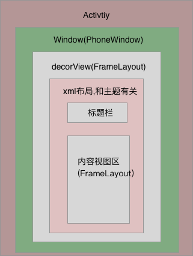

### Activity之setContentView
 
Activitiy中 

```
    /**
     * Set the activity content from a layout resource.  The resource will be
     * inflated, adding all top-level views to the activity.
     *
     * @param layoutResID Resource ID to be inflated.
     *
     * @see #setContentView(android.view.View)
     * @see #setContentView(android.view.View, android.view.ViewGroup.LayoutParams)
     */
    public void setContentView(int layoutResID) {
        getWindow().setContentView(layoutResID);
        initWindowDecorActionBar();
    }
```
设置contentView 实际上是先获取当前Activity的window 给window设置contentView , getWindow() 实际上是phoneWindow对象

window是在activity的attach方法中创建的

```
    final void attach(Context context, ActivityThread aThread,
            Instrumentation instr, IBinder token, int ident,
            Application application, Intent intent, ActivityInfo info,
            CharSequence title, Activity parent, String id,
            NonConfigurationInstances lastNonConfigurationInstances,
            Configuration config, String referrer, IVoiceInteractor voiceInteractor,
            Window window, ActivityConfigCallback activityConfigCallback) {
        attachBaseContext(context);

        mFragments.attachHost(null /*parent*/);
        //window的创建
        mWindow = new PhoneWindow(this, window, activityConfigCallback);
        mWindow.setWindowControllerCallback(this);
        mWindow.setCallback(this);
        mWindow.setOnWindowDismissedCallback(this);
        mWindow.getLayoutInflater().setPrivateFactory(this);
        if (info.softInputMode != WindowManager.LayoutParams.SOFT_INPUT_STATE_UNSPECIFIED) {
            mWindow.setSoftInputMode(info.softInputMode);
        }
        if (info.uiOptions != 0) {
            mWindow.setUiOptions(info.uiOptions);
        }
        mUiThread = Thread.currentThread();

        mMainThread = aThread;
        mInstrumentation = instr;
        mToken = token;
        mIdent = ident;
        mApplication = application;
        mIntent = intent;
        mReferrer = referrer;
        mComponent = intent.getComponent();
        mActivityInfo = info;
        mTitle = title;
        mParent = parent;
        mEmbeddedID = id;
        mLastNonConfigurationInstances = lastNonConfigurationInstances;
        if (voiceInteractor != null) {
            if (lastNonConfigurationInstances != null) {
                mVoiceInteractor = lastNonConfigurationInstances.voiceInteractor;
            } else {
                mVoiceInteractor = new VoiceInteractor(voiceInteractor, this, this,
                        Looper.myLooper());
            }
        }

        mWindow.setWindowManager(
                (WindowManager)context.getSystemService(Context.WINDOW_SERVICE),
                mToken, mComponent.flattenToString(),
                (info.flags & ActivityInfo.FLAG_HARDWARE_ACCELERATED) != 0);
        if (mParent != null) {
            mWindow.setContainer(mParent.getWindow());
        }
        mWindowManager = mWindow.getWindowManager();
        mCurrentConfig = config;

        mWindow.setColorMode(info.colorMode);

        setAutofillCompatibilityEnabled(application.isAutofillCompatibilityEnabled());
        enableAutofillCompatibilityIfNeeded();
    }
```


### PhoneWindow 

 activity的 decorView 的布局是在PhoneWindow初始化完成的
 
```
      public class PhoneWindow extends Window implements MenuBuilder.Callback {

       // This is the top-level view of the window, containing the window decor.
        //window的顶级view 继承于FrameLayout
          private DecorView mDecor;

         // This is the view in which the window contents are placed. It is either
          // mDecor itself, or a child of mDecor where the contents go.
          //就是Activity的 setContentView 添加到的地方
          private ViewGroup mContentParent;
          //是根据不同Theme加载到DecorView的xml的视图 包含了activity的标题和 contentView
          private ViewGroup mContentRoot;
          
          private LayoutInflater mLayoutInflater;

          private TextView mTitleView;

          // 在初始化mDecor的installDecor() 中 可以看到 mDecorContentParent =mDecor.findViewById(   R.id.decor_content_parent);
          //对应screen_action_bar.xml中的 ActionBarOverlayLayout id=id="@+id/decor_content_parent"
          private DecorContentParent mDecorContentParent;

        //省略.....
    
      }

```    
phoneWindow是activity的setContentView()的实际执行者

```
    @Override
    public void setContentView(int layoutResID) {
        // Note: FEATURE_CONTENT_TRANSITIONS may be set in the process of installing the window
        // decor, when theme attributes and the like are crystalized. Do not check the feature
        // before this happens.
        if (mContentParent == null) {
            installDecor();
        } else if (!hasFeature(FEATURE_CONTENT_TRANSITIONS)) {
            mContentParent.removeAllViews();
        }

        if (hasFeature(FEATURE_CONTENT_TRANSITIONS)) {
            final Scene newScene = Scene.getSceneForLayout(mContentParent, layoutResID,
                    getContext());
            transitionTo(newScene);
        } else {
            mLayoutInflater.inflate(layoutResID, mContentParent);
        }
        final Callback cb = getCallback();
        if (cb != null && !isDestroyed()) {
            cb.onContentChanged();
        }
    }

    @Override
    public void setContentView(View view) {
        setContentView(view, new ViewGroup.LayoutParams(MATCH_PARENT, MATCH_PARENT));
    }

    @Override
    public void setContentView(View view, ViewGroup.LayoutParams params) {
        // Note: FEATURE_CONTENT_TRANSITIONS may be set in the process of installing the window
        // decor, when theme attributes and the like are crystalized. Do not check the feature
        // before this happens.
        if (mContentParent == null) {
         //installDecor  
            installDecor();
        } else if (!hasFeature(FEATURE_CONTENT_TRANSITIONS)) {
            mContentParent.removeAllViews();
        }

        if (hasFeature(FEATURE_CONTENT_TRANSITIONS)) {
            view.setLayoutParams(params);
            final Scene newScene = new Scene(mContentParent, view);
            transitionTo(newScene);
        } else {
            mContentParent.addView(view, params);
        }
        final Callback cb = getCallback();
        if (cb != null && !isDestroyed()) {
            cb.onContentChanged();
        }
    }
    
```
 
可以看出 mContentParent 很关键, setContentView() 是设置到了mContentParent中, 要么是 从xml填充布局到了 mContentParent

```
mLayoutInflater.inflate(layoutResID, mContentParent);
```
  
要么是
 ```
 mContentParent.addView(view, params);  
 ```

###接下来看看mContentParent是怎么来的

在setContentView() 中 先会调用installDecor() 来完成mDecor 的初始化

```
    private void installDecor() {
      // 省略无关代码...
            mDecor = generateDecor();
      // 省略无关代码...
        if (mContentParent == null) {
            mContentParent = generateLayout(mDecor);
       }
      
    // 省略无关代码...
    
    }
```
    
源码看出mContentParent 是 通过mDecor生成的

```
      protected DecorView generateDecor() {
        return new DecorView(getContext(), -1);
    }

    private final class DecorView extends FrameLayout implements RootViewSurfaceTaker {
    //省略具体代码....
     }
```

看下mContentParent生成的具体方法

```
protected ViewGroup generateLayout(DecorView decor) {
        // Apply data from current theme.
        //使用当前主题

        TypedArray a = getWindowStyle();
        //省去一堆代码...


        //获取decor的布局Layout

        int layoutResource;
        int features = getLocalFeatures();
        // System.out.println("Features: 0x" + Integer.toHexString(features));
        if ((features & (1 << FEATURE_SWIPE_TO_DISMISS)) != 0) {
            layoutResource = R.layout.screen_swipe_dismiss;
        } else if ((features & ((1 << FEATURE_LEFT_ICON) | (1 << FEATURE_RIGHT_ICON))) != 0) {
            if (mIsFloating) {
                TypedValue res = new TypedValue();
                getContext().getTheme().resolveAttribute(
                        R.attr.dialogTitleIconsDecorLayout, res, true);
                layoutResource = res.resourceId;
            } else {
                layoutResource = R.layout.screen_title_icons;
            }
            // XXX Remove this once action bar supports these features.
            removeFeature(FEATURE_ACTION_BAR);
            // System.out.println("Title Icons!");
        } else if ((features & ((1 << FEATURE_PROGRESS) | (1 << FEATURE_INDETERMINATE_PROGRESS))) != 0
                && (features & (1 << FEATURE_ACTION_BAR)) == 0) {
            // Special case for a window with only a progress bar (and title).
            // XXX Need to have a no-title version of embedded windows.
            layoutResource = R.layout.screen_progress;
            // System.out.println("Progress!");
        } else if ((features & (1 << FEATURE_CUSTOM_TITLE)) != 0) {
            // Special case for a window with a custom title.
            // If the window is floating, we need a dialog layout
            if (mIsFloating) {
                TypedValue res = new TypedValue();
                getContext().getTheme().resolveAttribute(
                        R.attr.dialogCustomTitleDecorLayout, res, true);
                layoutResource = res.resourceId;
            } else {
                layoutResource = R.layout.screen_custom_title;
            }
            // XXX Remove this once action bar supports these features.
            removeFeature(FEATURE_ACTION_BAR);
        } else if ((features & (1 << FEATURE_NO_TITLE)) == 0) {
            // If no other features and not embedded, only need a title.
            // If the window is floating, we need a dialog layout
            if (mIsFloating) {
                TypedValue res = new TypedValue();
                getContext().getTheme().resolveAttribute(
                        R.attr.dialogTitleDecorLayout, res, true);
                layoutResource = res.resourceId;
            } else if ((features & (1 << FEATURE_ACTION_BAR)) != 0) {
                layoutResource = a.getResourceId(
                        R.styleable.Window_windowActionBarFullscreenDecorLayout,
                        R.layout.screen_action_bar);
            } else {
                layoutResource = R.layout.screen_title;
            }
            // System.out.println("Title!");
        } else if ((features & (1 << FEATURE_ACTION_MODE_OVERLAY)) != 0) {
            layoutResource = R.layout.screen_simple_overlay_action_mode;
        } else {
            // Embedded, so no decoration is needed.
            layoutResource = R.layout.screen_simple;
            // System.out.println("Simple!");
        }

        View in = mLayoutInflater.inflate(layoutResource, null);
      //decor 给decor 添加布局
        decor.addView(in, new ViewGroup.LayoutParams(MATCH_PARENT, MATCH_PARENT));


        ViewGroup contentParent = (ViewGroup)findViewById(ID_ANDROID_CONTENT);
     //public View findViewById(int id) {
     //        return getDecorView().findViewById(id);
     //  }
      //contentParenet 包含于 decor
        return contentParent;
    }
```
    
可以得出 activity setContentView()是把contentView添加到了当前activity的window的DecorView中的一个布局的id为content的FramLayout中,如下

```
<?xml version="1.0" encoding="utf-8"?>
<!-- Copyright (C) 2006 The Android Open Source Project

     Licensed under the Apache License, Version 2.0 (the "License");
     you may not use this file except in compliance with the License.
     You may obtain a copy of the License at
  
          http://www.apache.org/licenses/LICENSE-2.0
  
     Unless required by applicable law or agreed to in writing, software
     distributed under the License is distributed on an "AS IS" BASIS,
     WITHOUT WARRANTIES OR CONDITIONS OF ANY KIND, either express or implied.
     See the License for the specific language governing permissions and
     limitations under the License.
-->

<!--
This is an optimized layout for a screen, with the minimum set of features
enabled.
-->

<LinearLayout xmlns:android="http://schemas.android.com/apk/res/android"
    android:orientation="vertical"
    android:fitsSystemWindows="true">
    <!-- Popout bar for action modes -->
    <ViewStub android:id="@+id/action_mode_bar_stub"
              android:inflatedId="@+id/action_mode_bar"
              android:layout="@layout/action_mode_bar"
              android:layout_width="match_parent"
              android:layout_height="wrap_content"
              android:theme="?attr/actionBarTheme" />
    <FrameLayout
        android:layout_width="match_parent" 
        android:layout_height="?android:attr/windowTitleSize"
        style="?android:attr/windowTitleBackgroundStyle">
        <TextView android:id="@android:id/title" 
            style="?android:attr/windowTitleStyle"
            android:background="@null"
            android:fadingEdge="horizontal"
            android:gravity="center_vertical"
            android:layout_width="match_parent"
            android:layout_height="match_parent" />
    </FrameLayout>
    <FrameLayout android:id="@android:id/content"
        android:layout_width="match_parent" 
        android:layout_height="0dip"
        android:layout_weight="1"
        android:foregroundGravity="fill_horizontal|top"
        android:foreground="?android:attr/windowContentOverlay" />
</LinearLayout>

```
### Activity的层级如图



        