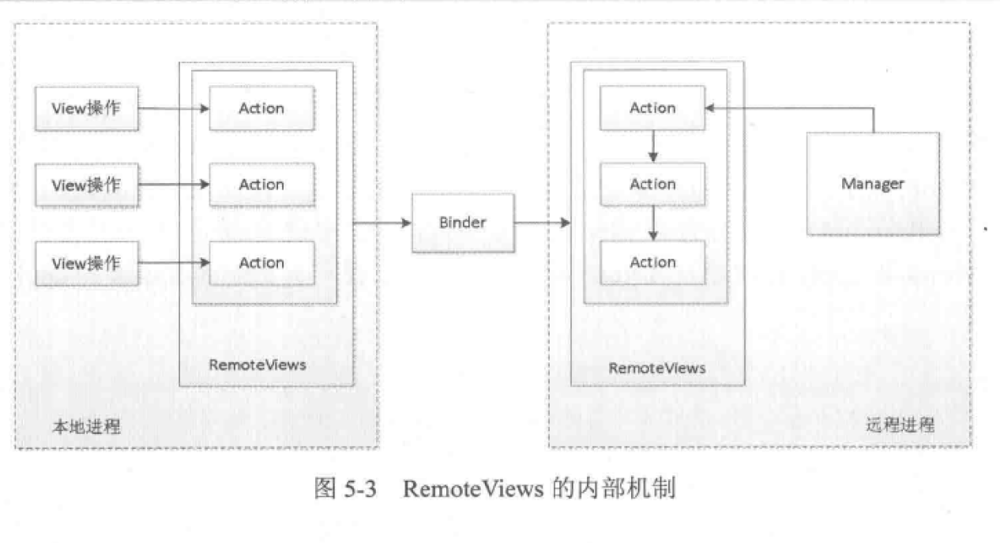

## RemoteView简记
#### 定义: 
一种远程View,是在其他进程中显示并更新View界面

####作用:
主要用于通知和桌面小部件

####属性设置 点击设置:
通过反射实现控件属性赋值,通过pendingIntent实现动作控件点击
#### 桌面小部件Widget:
本质是一个BroadcastReceiver
#### 摘抄
下面描述一下RemoteViews的内部机制，由于RemoteViews主要用于通知栏和桌面小部件之中，这里就通过它们来分析RemoteViews的工作过程。我们知道，**通知栏和桌面小部件分别由NotificationManager和AppWidgetManager管理**，而NotificationManager和AppWidgetManager通过Binder分别和SystemServer进程中的NotificationManagerService以及AppWidgetService进行通信。由此可见，通知栏和桌面小部件中的布局文件实际上是在而NotificationManagerService以及AppWidgetService中被加载的，而它们运行在系统的SystemServer中，这就和我们的进程构成了跨进程通信的场景。 ***首先RemoteViews会通过Binder传递到SystemServer进程***，这是因为RemoteViews实现了Parcelable接口，因此它可以跨进程传输，系统会根据RemoteViews中的包名等信息去得到该应用的资源。然后会通过LayoutInflater去加载RemoteViews中的布局文件。在SystemServer进程中加载后的布局文件是一个普通的View，只不过相对于我们的进程它是一个RemoteViews而已。接着系统会对View执行一系列界面更新任务，这些任务就是之前我们通过set方法来提交的。set方法对View所做的更新并不是立刻执行的，在RemoteViews内部会记录所有的更新操作，具体的执行时机要等到RemoteViews被加载以后才能执行，这样RemoteViews就可以在SystemServer进程中显示了，这就是我们所看到的通知栏消息或者桌面小部件。当需要更新RemoteViews时，我们需要调用一系列set方法并通过NotificationManager和AppWidgetManager来提交更新任务，具体的更新操作也是在SystemServer进程中完成的。

RemoteViews在通知栏和桌面小部件中的工作过程和上面描述的过程是一致的，当我们调用RemoteViews的set方法时，并不会立刻更新它们的界面，而必须要通过Notification-Manager的notify方法以及AppWidgetManager的updateAppWidget才能更新它们的界面。实际上在AppWidgetManager的updateAppWidget的内部实现中，它们的确是通过RemoteViews的apply以及reapply方法来加载或者更新界面的，apply和reApply的区别在于：apply会加载布局并更新界面，而reApply则只会更新界面。通知栏和桌面小插件在初始化界面时会调用apply方法，而在后续的更新界面时则会调用reapply方法。这里先看一下BaseStatusBar的updateNotificationViews方法中，如下所示。

从理论上来说，系统完全可以通过Binder去支持所有的View和View操作，但是这样做的话代价太大，因为View的方法太多了，另外就是大量的IPC操作会影响效率。为了解决这个问题，系统并没有通过Binder去直接支持View的跨进程访问，而是提供了一个Action的概念，Action代表一个View操作，Action同样实现了Parcelable接口。系统首先将View操作封装到Action对象并将这些对象跨进程传输到远程进程，接着在远程进程中执行Action对象中的具体操作。在我们的应用中每调用一次set方法，RemoteViews中就会添加一个对应的Action对象，当我们通过NotificationManager和AppWidgetManager来提交我们的更新时，这些Action对象就会传输到远程进程并在远程进程中依次执行，这个过程可以参看图5-3。远程进程通过RemoteViews的apply方法来进行View的更新操作，RemoteViews的apply方法内部则会去遍历所有的Action对象并调用它们的apply方法，具体的View更新操作是由Action对象的apply方法来完成的。上述做法的好处是显而易见的，首先不需要定义大量的Binder接口，其次通过在远程进程中批量执行RemoteViews的修改操作从而避免了大量的IPC操作，这就提高了程序的性能，由此可见，Android系统在这方面的设计的确很精妙。

