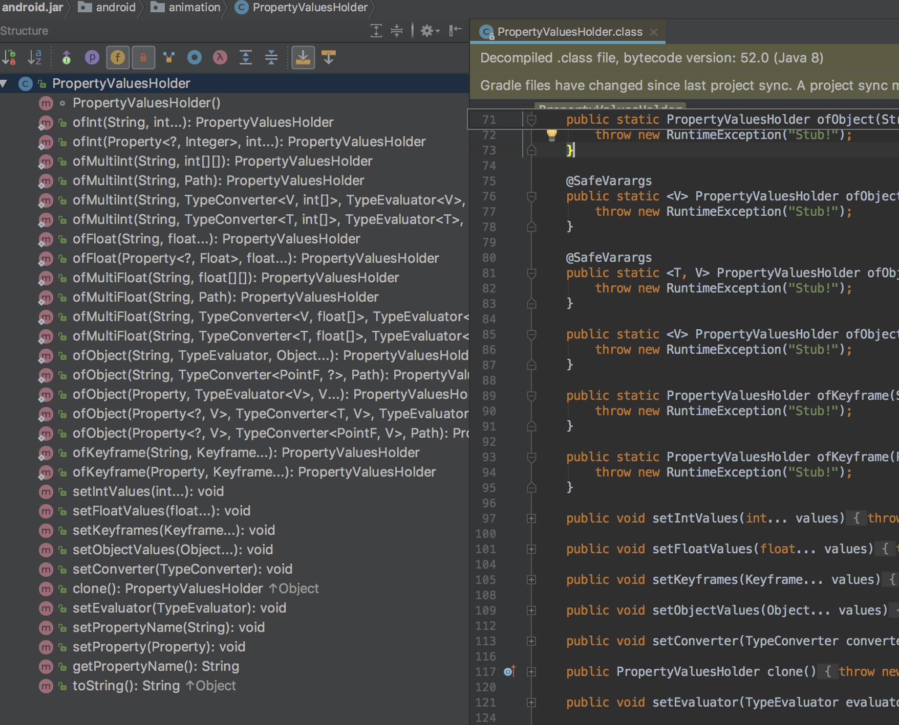

Android动画小结
======================

* Android动画分类

	a.视图动画(ViewAnimation)= Tween Animation（补间动画）+ Frame Animation(逐帧动画)

	b.属性动画(property Animator)=ValueAnimator + ObjectAnimator

* 为什么要使用Property Animator(和view动画的不同)

	1.为了实现view animation 无法实现的效果(view 动画对派生于view的控件的指定属性)

	2.View Animation仅能对指定的控件做动画，而Property Animator是通过改变控件某一属性值来做动画的。

	3.补间动画虽能对控件做动画，但并没有改变控件内部的属性值。而Property Animator则是恰恰相反，Property Animator是通过改变控件内部的属性值来达到动画效果的

### 一.view动画的使用:
##### 1.1、XML配置文件中

alpha
	渐变透明度动画效果
	
scale
	渐变尺寸伸缩动画效果
	
translate
	画面转换位置移动动画效果
	
rotate
	画面转移旋转动画效果
	

xml动画定义

```
Animation animation =AnimationUtils. loadAnimation(context ,R.anim.xxx);
view.startAnimation(animation);
```

```
Animation outAnim = AnimationUtils.loadAnimation(mContext, 
      R.anim.custom_dialog_disappear);
        outAnim.setAnimationListener(new Animation.AnimationListener() {
            @Override
            public void onAnimationStart(Animation animation) {
            //todo
            }

            @Override
            public void onAnimationEnd(Animation animation) {
                //todo
            }

            @Override
            public void onAnimationRepeat(Animation animation) {
               //todo
            }
        });
      
          view.startAnimation(outAnim);
          
```          
##### 1.2.代码使用
                final TranslateAnimation animation = new TranslateAnimation(Animation.ABSOLUTE, 0, Animation.ABSOLUTE, 400,  
                        Animation.ABSOLUTE, 0, Animation.ABSOLUTE, 400);  
                animation.setFillAfter(true);  
                animation.setDuration(1000);  
                tv.startAnimation(animation);  

##### 1.3.AnimationSet 
构造方法

```
    /**
     * Constructor to use when building an AnimationSet from code
     *
     * @param shareInterpolator Pass true if all of the animations in this set
     *        should use the interpolator associated with this AnimationSet.
     *        Pass false if each animation should use its own interpolator.
     */
    public AnimationSet(boolean shareInterpolator) {
        setFlag(PROPERTY_SHARE_INTERPOLATOR_MASK, shareInterpolator);
        init();
    }


    /* 
     *  将四种动画效果放入同一个AnimationSet中 
     */  
    animationSet.addAnimation(alphaAnimation);  
    animationSet.addAnimation(rotateAnimation);  
    animationSet.addAnimation(scaleAnimation);  
    animationSet.addAnimation(translateAnimation);  
  
    /* 
     *  同时执行多个动画效果 
     */  
    view.startAnimation(animationSet); 
    
```

#### 二.property animator


常用

* ofxxx
* ofObject
* ofPropertyValuesHolder

##### 2.1.value animator
* offxxx

```
    ValueAnimator animator = ValueAnimator.ofFloat(startY, endY);
        animator.setDuration(300);
        animator.setInterpolator(new DecelerateInterpolator());
        animator.addUpdateListener(new ValueAnimator.AnimatorUpdateListener() {
            @Override
            public void onAnimationUpdate(ValueAnimator animation) {

                float animatedFraction = animation.getAnimatedFraction();
             float y = (float) animation.getAnimatedValue();
             
                    xxx.setY(y);
                    xxx.setAlpha(animatedFraction);

            }
        });

        animator.start();
```  

* ofObject

```

    /**
     * Constructs and returns a ValueAnimator that animates between Object values. A single
     * value implies that that value is the one being animated to. However, this is not typically
     * useful in a ValueAnimator object because there is no way for the object to determine the
     * starting value for the animation (unlike ObjectAnimator, which can derive that value
     * from the target object and property being animated). Therefore, there should typically
     * be two or more values.
     *
     * <p><strong>Note:</strong> The Object values are stored as references to the original
     * objects, which means that changes to those objects after this method is called will
     * affect the values on the animator. If the objects will be mutated externally after
     * this method is called, callers should pass a copy of those objects instead.
     *
     * <p>Since ValueAnimator does not know how to animate between arbitrary Objects, this
     * factory method also takes a TypeEvaluator object that the ValueAnimator will use
     * to perform that interpolation.
     *
     * @param evaluator A TypeEvaluator that will be called on each animation frame to
     * provide the ncessry interpolation between the Object values to derive the animated
     * value.
     * @param values A set of values that the animation will animate between over time.
     * @return A ValueAnimator object that is set up to animate between the given values.
     */
    public static ValueAnimator ofObject(TypeEvaluator evaluator, Object... values) {
        ValueAnimator anim = new ValueAnimator();
        anim.setObjectValues(values);
        anim.setEvaluator(evaluator);
        return anim;
    }
.


    public class CharEvaluator implements TypeEvaluator<Character> {  
    @Override  
    public Character evaluate(float fraction, Character startValue, Character endValue) {  
        int startInt  = (int)startValue;  
        int endInt = (int)endValue;  
        int curInt = (int)(startInt + fraction *(endInt - startInt));  
        char result = (char)curInt;  
        return result;  
       }  
    } 
--
  
      ValueAnimator animator = ValueAnimator.ofObject(new CharEvaluator(),new Character('A'),new Character('Z'));  
    animator.addUpdateListener(new ValueAnimator.AnimatorUpdateListener() {  
        @Override  
        public void onAnimationUpdate(ValueAnimator animation) {  
            char text = (char)animation.getAnimatedValue();  
            tv.setText(String.valueOf(text));  
        }  
    });  
    animator.setDuration(10000);  
    animator.setInterpolator(new AccelerateInterpolator());  
    animator.start();  
```

##### 2.2.object Animator
缩放操作，比如说将TextView在垂直方向上放大3倍再还原，就可以这样写：

```
    ObjectAnimator = ObjectAnimator.ofFloat(targetView, "scaleY", 1f, 3f, 1f);  
    animator.setDuration(5000);  
    animator.start();
```

##### 2.3.animatorSet

* set.playTogether

```
AnimatorSet set=new AnimatorSet();
set.playTogether(animator1,animator2)
```

合并播放源码

```
     public void playTogether(Animator... items) {
        if (items != null) {
            Builder builder = play(items[0]);
            for (int i = 1; i < items.length; ++i) {
                builder.with(items[i]);
            }
        }
    }

```

*  animSet.start() 

```
    ObjectAnimator moveIn = ObjectAnimator.ofFloat(textview, "translationX", -500f, 0f);  
    ObjectAnimator rotate = ObjectAnimator.ofFloat(textview, "rotation", 0f, 360f);  
    ObjectAnimator fadeInOut = ObjectAnimator.ofFloat(textview, "alpha", 1f, 0f, 1f);  
    AnimatorSet animSet = new AnimatorSet();  
    animSet.play(rotate).with(fadeInOut).after(moveIn);  
    animSet.setDuration(5000);  
    animSet.start();  
```
##### 2.4.xml编写属性动画
首先要在res目录下面新建一个animator文件夹
    <animator>  对应代码中的ValueAnimator
    <objectAnimator>  对应代码中的ObjectAnimator
    <set>  对应代码中的AnimatorSet
      
        <objectAnimator  
            android:duration="2000"  
            android:propertyName="translationX"  
            android:valueFrom="-500"  
            android:valueTo="0"  
            android:valueType="floatType" >  
        </objectAnimator>  
      
        <set android:ordering="together" >  
            <objectAnimator  
                android:duration="3000"  
                android:propertyName="rotation"  
                android:valueFrom="0"  
                android:valueTo="360"  
                android:valueType="floatType" >  
            </objectAnimator>  
      
            <set android:ordering="sequentially" >  
                <objectAnimator  
                    android:duration="1500"  
                    android:propertyName="alpha"  
                    android:valueFrom="1"  
                    android:valueTo="0"  
                    android:valueType="floatType" >  
                </objectAnimator>  
                <objectAnimator  
                    android:duration="1500"  
                    android:propertyName="alpha"  
                    android:valueFrom="0"  
                    android:valueTo="1"  
                    android:valueType="floatType" >  
                </objectAnimator>  
            </set>  
        </set>    
    </set>  
--

    Animator animator = AnimatorInflater.loadAnimator(context, R.animator.anim_file);  
    animator.setTarget(view);  
    animator.start();  

##### 2.5 PropertyValuesHolder(**ObjectAnimator.ofPropertyValuesHolder**)

 This class holds information about a property and the values that that property
  should take on during an animation. PropertyValuesHolder objects can be used to create
  animations with ValueAnimator or ObjectAnimator that operate on several different properties in parallel.

PropertyValuesHolder这个类可以先将动画属性和值暂时的存储起来，后一起执行，在有些时候可以使用替换掉AnimatorSet



 
###### 2.5.1 PropertyValuesHolder.ofKeyframe
public static PropertyValuesHolder ofKeyframe(String propertyName, Keyframe... values)  

*   *propertyName：**动画所要操作的属性名
*   **values：**Keyframe的列表，PropertyValuesHolder会根据每个Keyframe的设定，定时将指定的值输出给动画。 

所以完整的KeyFrame的使用代码应该是这样的：


```
    1.  Keyframe frame0 = Keyframe.ofFloat(0f, 0);  
    2.  Keyframe frame1 = Keyframe.ofFloat(0.1f, -20f);  
    3.  Keyframe frame2 = Keyframe.ofFloat(1, 0);  
    4.  PropertyValuesHolder frameHolder =  ' PropertyValuesHolder.ofKeyframe ' ("rotation",frame0,frame1,frame2);  
    5.  Animator animator =' ObjectAnimator.ofPropertyValuesHolder ' (mImage,frameHolder);  
    6.  animator.setDuration(1000);  
    7.  animator.start();
```

######  2.5.2 PropertyValuesHolder.ofXXX

ObjectAnimator.ofFloat中只比PropertyValuesHolder的ofFloat多了一个target，其它都是完全一样的

###### 2.5.3  PropertyValuesHolder.ofObject
```
      PropertyValuesHolder charHolder =     
      PropertyValuesHolder.ofObject("CharText",new CharEvaluator(),new 
      Character('A'),new Character('Z'));  
      ObjectAnimator animator = ObjectAnimator.ofPropertyValuesHolder(mTextView, 
     charHolder);  
      animator.setDuration(3000);  
      animator.setInterpolator(new AccelerateInterpolator());  
      animator.start(); 
```

###### 2.5.4 ObjectAnimator. ofPropertyValuesHolder(view, PropertyValuesHolder_1, PropertyValuesHolder_2 ....)

```
    //keyframe
        Keyframe keyframe1 = Keyframe.ofFloat(0.0f,0);
        Keyframe keyframe2 = Keyframe.ofFloat(0.25f,-30);
        Keyframe keyframe3 = Keyframe.ofFloat(0.5f,0);
        Keyframe keyframe4 = Keyframe.ofFloat(0.75f, 30);
        Keyframe keyframe5 = Keyframe.ofFloat(1.0f,0);
        PropertyValuesHolder rotation = PropertyValuesHolder.ofKeyframe("rotation", keyframe1, keyframe2, keyframe3, keyframe4,keyframe5);


    PropertyValuesHolder alpha = PropertyValuesHolder.ofFloat("alpha",1.0f,0.2f,1.0f);
        PropertyValuesHolder scaleX = PropertyValuesHolder.ofFloat("scaleX",1.0f,0.2f,1.0f);
        PropertyValuesHolder scaleY = PropertyValuesHolder.ofFloat("scaleY",1.0f,0.2f,1.0f);
        PropertyValuesHolder color = PropertyValuesHolder.ofInt("BackgroundColor", 0XFFFFFF00, 0XFF0000FF);

        ObjectAnimator animator = ObjectAnimator.ofPropertyValuesHolder(mButton, alpha, scaleX, scaleY,color,rotation);
        animator.setInterpolator(new OvershootInterpolator());
        animator.setDuration(5000).start();
---


       int riseDelta = ScreenUtil.dp2px(220);
        view.setVisibility(View.VISIBLE);
        PropertyValuesHolder riseKeyboard = PropertyValuesHolder.ofKeyframe(View.TRANSLATION_Y,
                Keyframe.ofFloat(0f, riseDelta),
                Keyframe.ofFloat(0.1f, riseDelta * 0.9f),
                Keyframe.ofFloat(0.2f, riseDelta * 0.8f),
                Keyframe.ofFloat(0.3f, riseDelta * 0.7f),
                Keyframe.ofFloat(0.4f, riseDelta * 0.6f),
                Keyframe.ofFloat(0.5f, riseDelta * 0.5f),
                Keyframe.ofFloat(0.6f, riseDelta * 0.4f),
                Keyframe.ofFloat(0.7f, riseDelta * 0.3f),
                Keyframe.ofFloat(0.8f, riseDelta * 0.2f),
                Keyframe.ofFloat(0.9f, riseDelta * 0.1f),
                Keyframe.ofFloat(1f, 0f)
        );

        ObjectAnimator animator = ObjectAnimator.ofPropertyValuesHolder(view, riseKeyboard).
                setDuration(300);
        animator.setInterpolator(new DecelerateInterpolator());
demo02

    PropertyValuesHolder rotationHolder = PropertyValuesHolder.ofFloat("Rotation", 
    60f, -60f, 40f, -40f, -20f, 20f, 10f, -10f, 0f);  
    PropertyValuesHolder colorHolder = 
    PropertyValuesHolder.ofInt("BackgroundColor", 0xffffffff, 0xffff00ff, 0xffffff00, 
    0xffffffff);  
    ObjectAnimator animator = ObjectAnimator.ofPropertyValuesHolder(mTextView, 
    rotationHolder, colorHolder);  
    animator.setDuration(3000);  
    animator.setInterpolator(new AccelerateInterpolator());  
    animator.start();
```

###### 2.6.新api ViewPropertianimator

```
    ViewPropertyAnimator animate = mViewById.animate();

                Runnable mStartRun = new Runnable() {
                    @Override
                    public void run() {
                        Toast.makeText(getApplicationContext(), "动画开始", Toast.LENGTH_SHORT).show();
                    }
                };


                Runnable endRun = new Runnable() {
                    @Override
                    public void run() {
                        Toast.makeText(getApplicationContext(), "动画完成", Toast.LENGTH_SHORT).show();
                    }
                };

                animate.alpha(0.5f)
                        .translationX(100)
                        .rotationBy(90)
                        .withStartAction(mStartRun)
                        .withEndAction(endRun)
                        .setInterpolator(new OvershootInterpolator())
                        .start();
            }

```


#### [郭霖的专栏](http://blog.csdn.net/guolin_blog)
[Android属性动画完全解析(上)，初识属性动画的基本用法](http://blog.csdn.net/guolin_blog/article/details/43536355)

###  三 . ViewGroup Animation
#### 3.1. LayoutAnimation

* LayoutAnimationController
* GridLayoutAnimationController

##### 3.1.1 LayoutAnimationController

##### xml 实现
这部分，我们就来看看layoutAnimation标签的用法，要使用layoutAnimation只需要两步：
第一：定义一个layoutAnimation的animation文件，如：(anim/layout_animation.xml)

```
      <?xml version="1.0" encoding="utf-8"?>
      <layoutAnimation xmlns:android="http://schemas.android.com/apk/res/android"
                 android:delay="1"
                 android:animationOrder="normal"
                 android:animation="@anim/slide_in_left"/>

```

其中的@anim/slide_in_left对应代码为：

```
        <?xml version="1.0" encoding="utf-8"?>
        <set xmlns:android="http://schemas.android.com/apk/res/android" 
                android:duration="1000">
        <translate android:fromXDelta="-50%p" android:toXDelta="0"/>
        <alpha android:fromAlpha="0.0" android:toAlpha="1.0"/>
        </set>

```

第二步：在viewGroup类型的控件中，添加android:layoutAnimation=”@anim/layout_animation”，如：

```
       <ListView
        android:id="@+id/listview"
        android:layout_width="match_parent"
        android:layout_height="match_parent"
        android:layoutAnimation="@anim/layout_animation"
        />

```
##### 代码实现 LayoutAnimationController

```
/**
 * A layout animation controller is used to animated a layout's, or a view
 * group's, children. Each child uses the same animation but for every one of
 * them, the animation starts at a different time. A layout animation controller
 * is used by {@link android.view.ViewGroup} to compute the delay by which each
 * child's animation start must be offset. The delay is computed by using
 * characteristics of each child, like its index in the view group.
 *
 * This standard implementation computes the delay by multiplying a fixed
 * amount of miliseconds by the index of the child in its parent view group.
 * Subclasses are supposed to override
 * {@link #getDelayForView(android.view.View)} to implement a different way
 * of computing the delay. For instance, a
 * {@link android.view.animation.GridLayoutAnimationController} will compute the
 * delay based on the column and row indices of the child in its parent view
 * group.
 *
 * Information used to compute the animation delay of each child are stored
 * in an instance of
 * {@link android.view.animation.LayoutAnimationController.AnimationParameters},
 * itself stored in the {@link android.view.ViewGroup.LayoutParams} of the view.
 *
 * @attr ref android.R.styleable#LayoutAnimation_delay
 * @attr ref android.R.styleable#LayoutAnimation_animationOrder
 * @attr ref android.R.styleable#LayoutAnimation_interpolator
 * @attr ref android.R.styleable#LayoutAnimation_animation
 */
public class LayoutAnimationController { .... }
```

布局与xml的实现方式一样，唯一不同的是Listview中没有定义android:layoutAnimation=”@anim/layout_animation”

```
      //代码设置通过加载XML动画设置文件来创建一个Animation对象；
        Animation animation= AnimationUtils.loadAnimation(this,R.anim.slide_in_left);         
       //得到一个 'LayoutAnimationController' 对象；
        LayoutAnimationController controller = new  LayoutAnimationController(animation);  
      
         //设置控件显示的顺序；
        controller.setOrder(LayoutAnimationController.ORDER_REVERSE);  
       //设置控件显示间隔时间；
        controller.setDelay(0.3f);   //为ListView设置LayoutAnimationController属性；
        mListView.setLayoutAnimation(controller);
        mListView.startLayoutAnimation();
```

#### 3.1.2 gridLayoutAnimation

###### 3.1.2.1xml

1）、首先是gride_animation.xml

```
      <?xml version="1.0" encoding="utf-8"?>
      <gridLayoutAnimation xmlns:android="http://schemas.android.com/apk/res/android"
                     android:rowDelay="75%"
                     android:columnDelay="60%"
                     android:directionPriority="none"
                     android:animation="@anim/slide_in_left"/>

``` 
这里没有设置android:direction属性，采用默认值：left_to_right|top_to_bottom；然后是对应的animation动画slide_in_left.xml:

```
    <?xml version="1.0" encoding="utf-8"?>
    <set xmlns:android="http://schemas.android.com/apk/res/android" android:duration="1000">
    <translate android:fromXDelta="-50%p" android:toXDelta="0"/>
    <alpha android:fromAlpha="0.0" android:toAlpha="1.0" />
    </set>

```

与LayoutAnimation所使用的动画一样，也是从左侧50%的位置移动到初始位置，同时透明度从0变到1；

```
    <GridView
            android:id="@+id/grid"
            android:layout_width="match_parent"
            android:layout_height="match_parent"
            android:columnWidth="60dp"
            android:gravity="center"
            android:horizontalSpacing="10dp"

            android:layoutAnimation="@anim/gride_animation"

            android:numColumns="auto_fit"
            android:stretchMode="columnWidth"
            android:verticalSpacing="10dp"/>
```   
    
3.1.2.2 代码使用

```
         GridView grid = (GridView) findViewById(R.id.grid);
        mDatas.addAll(getData());
        mGrideAdapter = new GridAdapter();
        grid.setAdapter(mGrideAdapter);

        Animation animation = AnimationUtils.loadAnimation(MyActivity.this,R.anim.slide_in_left);
        GridLayoutAnimationController controller = new GridLayoutAnimationController(animation);
        controller.setColumnDelay(0.75f);
        controller.setRowDelay(0.5f);
        controller.setDirection(GridLayoutAnimationController.DIRECTION_BOTTOM_TO_TOP|GridLayoutAnimationController.DIRECTION_LEFT_TO_RIGHT);
        controller.setDirectionPriority(GridLayoutAnimationController.PRIORITY_NONE);
        grid.setLayoutAnimation(controller);
        grid.startLayoutAnimation();
```

3.1.2.3 gridLayoutAnimation标签属性
 
directionPriority指gridview动画优先级，取值有**row,column,none**.意义分别为行优先，列优先，和无优先级（同时进行）

direction表示gridview的各个item的动画方向，取值如下，可以通过“|”连接多个属性值。取值有四个：

```
- left_to_right：列，从左向右开始动画
- right_to_left ：列，从右向左开始动画
- top_to_bottom：行，从上向下开始动画
- bottom_to_top：行，从下向上开始动画
```
#### 3.2 LayoutTransaction

上面虽然在ViewGroup类控件XML中仅添加一行android:animateLayoutChanges=[true]即可实现内部控件添加删除时都加上动画效果。但却只能使用默认动画效果，而无法自定义动画。
为了能让我们自定义动画，谷歌在API 11时，同时为我们引入了一个类LayoutTransaction。
要使用LayoutTransaction是非常容易的，只需要三步： 
**a 创建实例**

```
 LayoutTransaction transitioner = new LayoutTransition();  
```
**b 创建设置动画**

```
  ObjectAnimator animOut = ObjectAnimator.ofFloat(null, "rotation", 0f, 90f, 0f);  
  transitioner.setAnimator(LayoutTransition.DISAPPEARING, animOut);  
```

**c 将LayoutTransaction设置进ViewGroup**


```
 linearLayout.setLayoutTransition(mTransitioner);


       layoutTransitionGroup = (LinearLayout) findViewById(R.id.layoutTransitionGroup);  
        findViewById(R.id.add_btn).setOnClickListener(this);  
        findViewById(R.id.remove_btn).setOnClickListener(this);  
  
        mTransitioner = new LayoutTransition();  
        //入场动画:view在这个容器中消失时触发的动画  
        ObjectAnimator animIn = ObjectAnimator.ofFloat(null, "rotationY", 0f, 360f,0f);  
        mTransitioner.setAnimator(LayoutTransition.APPEARING, animIn);  
  
        //出场动画:view显示时的动画  
        ObjectAnimator animOut = ObjectAnimator.ofFloat(null, "rotation", 0f, 90f, 0f);  
        mTransitioner.setAnimator(LayoutTransition.DISAPPEARING, animOut);  
        
``` 
 
##### 3.3 listView 动画

思路 convertView 添加动画
[http://blog.csdn.net/harvic880925/article/details/50988685](http://blog.csdn.net/harvic880925/article/details/50988685)