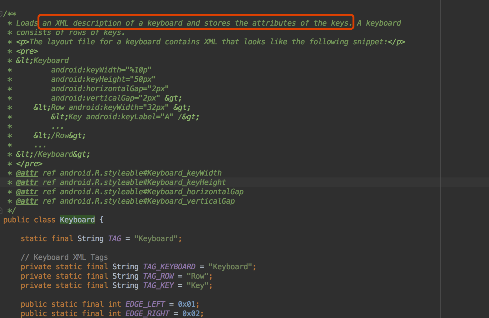

# 自定义输入法和键盘 01
 
## 1.首先有几个关键类
1.InputMethodService   2.Keyboard  3.KeyboardView

### 1.1 InputMethodService   

看下这个类的介绍

InputMethodService provides a standard implementation of an InputMethod
作用 提供一个标准键盘实现 balabala.....


请参考 http://blog.csdn.net/weijinqian0/article/details/76906317


### 1.2.Keyboard 源码分析


xmL 定义键盘的属性 : 键位宽/高/水平间距/垂直间距/按键文字图标/键值.....
键盘的UI样式就在这个类里面定义,准确的说 是在keyboard加载的xml文件中定义

构造方法 
传入键盘布局文件id

        /**
         * Creates a keyboard from the given xml key layout file.
         * @param context the application or service context
         * @param xmlLayoutResId the resource file that contains the keyboard layout and keys.
         */
        public Keyboard(Context context, int xmlLayoutResId) {
        this(context, xmlLayoutResId, 0);
       }


         /**
     * Creates a keyboard from the given xml key layout file. Weeds out rows
     * that have a keyboard mode defined but don't match the specified mode.
     * @param context the application or service context
     * @param xmlLayoutResId the resource file that contains the keyboard layout and keys.
     * @param modeId keyboard mode identifier
     * @param width sets width of keyboard
     * @param height sets height of keyboard
     */
    public Keyboard(Context context, @XmlRes int xmlLayoutResId, int modeId, int width,
            int height) {
        mDisplayWidth = width;
        mDisplayHeight = height;

        mDefaultHorizontalGap = 0;
        mDefaultWidth = mDisplayWidth / 10;
        mDefaultVerticalGap = 0;
        mDefaultHeight = mDefaultWidth;
        mKeys = new ArrayList<Key>();
        mModifierKeys = new ArrayList<Key>();
        mKeyboardMode = modeId;
    //加载键盘
        loadKeyboard(context, context.getResources().getXml(xmlLayoutResId));
    }

xml 解析键盘布局

    private void loadKeyboard(Context context, XmlResourceParser parser) {
        boolean inKey = false;
        boolean inRow = false;
        boolean leftMostKey = false;
        int row = 0;
        int x = 0;
        int y = 0;
        Key key = null;
        Row currentRow = null;
        Resources res = context.getResources();
        boolean skipRow = false;

        try {
            int event;
            while ((event = parser.next()) != XmlResourceParser.END_DOCUMENT) {
                if (event == XmlResourceParser.START_TAG) {
                    String tag = parser.getName();
                    if (TAG_ROW.equals(tag)) {
                        inRow = true;
                        x = 0;
                        currentRow = createRowFromXml(res, parser);
                        rows.add(currentRow);
                        skipRow = currentRow.mode != 0 && currentRow.mode != mKeyboardMode;
                        if (skipRow) {
                            skipToEndOfRow(parser);
                            inRow = false;
                        }
                   } else if (TAG_KEY.equals(tag)) {
                        inKey = true;
                        key = createKeyFromXml(res, currentRow, x, y, parser);
                        mKeys.add(key);
                        if (key.codes[0] == KEYCODE_SHIFT) {
                            // Find available shift key slot and put this shift key in it
                            for (int i = 0; i < mShiftKeys.length; i++) {
                                if (mShiftKeys[i] == null) {
                                    mShiftKeys[i] = key;
                                    mShiftKeyIndices[i] = mKeys.size()-1;
                                    break;
                                }
                            }
                            mModifierKeys.add(key);
                        } else if (key.codes[0] == KEYCODE_ALT) {
                            mModifierKeys.add(key);
                        }
                        currentRow.mKeys.add(key);
                    } else if (TAG_KEYBOARD.equals(tag)) {
                        parseKeyboardAttributes(res, parser);
                    }
                } else if (event == XmlResourceParser.END_TAG) {
                    if (inKey) {
                        inKey = false;
                        x += key.gap + key.width;
                        if (x > mTotalWidth) {
                            mTotalWidth = x;
                        }
                    } else if (inRow) {
                        inRow = false;
                        y += currentRow.verticalGap;
                        y += currentRow.defaultHeight;
                        row++;
                    } else {
                        // TODO: error or extend?
                    }
                }
            }
        } catch (Exception e) {
            Log.e(TAG, "Parse error:" + e);
            e.printStackTrace();
        }
        mTotalHeight = y - mDefaultVerticalGap;
    }

### 1.3.KeyboardView :自定义键盘一般继承keyboardView 重写其方法


作用:渲染按键  侦测按压  


    <com.example.ableqing.androidkeyboardviewdemo.keyboard.MyKeyboardView

        android:id="@+id/keyboardView"
        android:layout_width="match_parent"
        android:layout_height="wrap_content"
        android:layout_alignParentBottom="true"
        android:background="#ECECEC"
     //每一个按键的背景 (全部)
      android:keyBackground="@drawable/btn_keyboard_key"
      //预览的view 的高度
        android:keyPreviewHeight="100dp"
      //按键预览的布局
        android:keyPreviewLayout="@layout/keyboard_preview"
      //按键预览的pop的y轴偏移量
        android:keyPreviewOffset="50dp"
        android:keyTextColor="#4F4F4F"
        android:shadowColor="#FFFFFF"
        android:shadowRadius="0.0"

        app:layout_constraintBottom_toBottomOf="parent"
        app:layout_constraintStart_toStartOf="parent"/>


## 2. 具体实现

### 2.1 自定义键盘继承KeyboardView 当然也可以不定义 直接使用keyboardView

### 2.2 创建布局文件

     <?xml version="1.0" encoding="utf-8"?>
    <android.support.v7.widget.LinearLayoutCompat
    xmlns:android="http://schemas.android.com/apk/res/android"
    xmlns:app="http://schemas.android.com/apk/res-auto"
    android:layout_width="match_parent"
    android:layout_height="match_parent"
    android:gravity="bottom"
    android:orientation="vertical">

       <!--keyboard_preview 显示区占位-->
    <View
        android:layout_width="match_parent"
        android:layout_height="100dp"/>

     <com.example.ableqing.androidkeyboardviewdemo.keyboard.MyKeyboardView

        android:id="@+id/keyboardView"
        android:layout_width="match_parent"
        android:layout_height="wrap_content"
        android:layout_alignParentBottom="true"
        android:background="#ECECEC"
        android:focusable="true"
        android:focusableInTouchMode="true"
        android:keyBackground="@drawable/btn_keyboard_key"
        android:keyPreviewHeight="100dp"
        android:keyPreviewLayout="@layout/keyboard_preview"
        android:keyPreviewOffset="50dp"
        android:keyTextColor="#4F4F4F"
        android:shadowColor="#FFFFFF"
        android:shadowRadius="0.0"

        app:layout_constraintBottom_toBottomOf="parent"
        app:layout_constraintStart_toStartOf="parent"/>


    </android.support.v7.widget.LinearLayoutCompat>

### 2.3  新建服务继承InputMethodService

     public class MyInputMethodService extends InputMethodService {
     @Override
     public View onCreateInputView() {

        View view = getLayoutInflater().
                //键盘的布局文件
                inflate(R.layout.keyboard_global, null);

        return view;
      }
     }

清单文件

        <service
            android:name="com.example.ableqing.androidkeyboardviewdemo.MyInputMethodService"
            android:label="@string/keyboard_name"
            android:permission="android.permission.BIND_INPUT_METHOD">
            <intent-filter>
                <action android:name="android.view.InputMethod"/>
            </intent-filter>
            <meta-data
                android:name="android.view.im"
                android:resource="@xml/method"/>
        </service>
### 2.4 xml 定义键盘的resource 文件 和 不同键盘布局文件


  字母键盘的布局

    <?xml version="1.0" encoding="UTF-8"?>
    <Keyboard xmlns:android="http://schemas.android.com/apk/res/android"
          android:horizontalGap="0.9%p"
          android:keyHeight="52dp"
          android:keyWidth="9%p"
          android:verticalGap="0px">


    <Row>
        <Key
            android:codes="113"
            android:keyEdgeFlags="left"
            android:keyLabel="q"/>
        <Key
            android:codes="119"
            android:keyLabel="w"/>
        <Key
            android:codes="101"
            android:keyLabel="e"/>
        <Key
            android:codes="114"
            android:keyLabel="r"/>
        <Key
            android:codes="116"
            android:keyLabel="t"/>
        <Key
            android:codes="121"
            android:keyLabel="y"/>
        <Key
            android:codes="117"
            android:keyLabel="u"/>
        <Key
            android:codes="105"
            android:keyLabel="i"/>
        <Key
            android:codes="111"
            android:keyLabel="o"/>
        <Key
            android:codes="112"
            android:keyEdgeFlags="right"
            android:keyLabel="p"/>
    </Row>
    <Row>
        <Key
            android:codes="97"
            android:horizontalGap="6%p"
            android:keyEdgeFlags="left"
            android:keyLabel="a"/>
        <Key
            android:codes="115"
            android:keyLabel="s"/>
        <Key
            android:codes="100"
            android:keyLabel="d"/>
        <Key
            android:codes="102"
            android:keyLabel="f"/>
        <Key
            android:codes="103"
            android:keyLabel="g"/>
        <Key
            android:codes="104"
            android:keyLabel="h"/>
        <Key
            android:codes="106"
            android:keyLabel="j"/>
        <Key
            android:codes="107"
            android:keyLabel="k"/>
        <Key
            android:codes="108"

            android:keyLabel="l"/>


    </Row>
    <Row>
        <Key
            android:codes="-1"
            android:isModifier="true"
            android:isSticky="true"
            android:keyEdgeFlags="left"
            android:keyWidth="12.6%p"/>
        <Key
            android:codes="122"
            android:horizontalGap="2.3%p"
            android:keyLabel="z"
            android:keyWidth="9%p"/>
        <Key
            android:codes="120"
            android:keyLabel="x"
            android:keyWidth="9%p"/>
        <Key
            android:codes="99"
            android:keyLabel="c"
            android:keyWidth="9%p"/>
        <Key
            android:codes="118"
            android:keyLabel="v"
            android:keyWidth="9%p"/>
        <Key
            android:codes="98"
            android:keyLabel="b"
            android:keyWidth="9%p"/>
        <Key
            android:codes="110"
            android:keyLabel="n"
            android:keyWidth="9%p"/>
        <Key
            android:codes="109"
            android:keyLabel="m"
            android:keyWidth="9%p"/>

        <Key
            android:codes="-5"
            android:horizontalGap="2.3%p"
            android:isRepeatable="true"
            android:keyEdgeFlags="right"
            android:keyIcon="@mipmap/key_back"
            android:keyWidth="12.6%p"/>


    </Row>


    <Row android:rowEdgeFlags="bottom">
        <Key
            android:codes="-101"
            android:keyEdgeFlags="left"
            android:keyLabel="123"
            android:keyWidth="12.6%p"/>
        <Key
            android:codes="-105"
            android:keyIcon="@mipmap/key_switch"
            android:keyWidth="12.6%p"/>

        <Key
            android:codes="-100"
            android:keyIcon="@mipmap/key_setting"
            android:keyWidth="11%p"/>
        <Key
            android:codes="32"
            android:isRepeatable="true"
            android:keyLabel="space"
            android:keyWidth="34.2%p"/>

        <Key


            android:codes="-4"
            android:keyEdgeFlags="right"
            android:keyLabel="return"
            android:keyWidth="24%p"/>
    </Row>


    </Keyboard>

####  xml 中定义布局的 属性
```
keyLabel 	按键显示的内容
keyIcon 	按键显示的图标内容
keyWidth 	按键的宽度
keyHeight 	按键的高度
horizontalGap 	代表按键前的间隙水平方向上的
isSticky 	按键是否是sticky的，就像shift 键 具有两种状态
isModifier 	按键是不是功能键
keyOutputText 	指定按键输出的内容是字符串
isRepeatable 	按键是可重复的，如果长按键可以触发重复按键事件则为true，else为false
keyEdgeFlags 	指定按键的对齐指令，取值为left或者right
```


### 2.5 设置和选择输入法


<!---->


##### 2.5.1 跳转输入法设置界面：
```
  Intent intent = new Intent();  
  intent.setAction( Settings.ACTION_INPUT_METHOD_SETTINGS);  
  SoftDemoActivity.this.startActivity(intent);  
```


##### 2.5.2 弹出输入法选择框
```
 ((InputMethodManager) service.getSystemService(Context.INPUT_METHOD_SERVICE)).showInputMethodPicker();
```
 


### 2.6 效果预览


## 3问题处理 
### 3.1 第一排按键预览位置错误


对比下讯飞输入法


可以看出讯飞输入法上面还有一个透明布局 


按键的预览本质是一个popupwindow


在keyboardViwe 源码中可以看到按键预览的实现方式,按键预览的pop的位置不会超过给 InputMethodService 的布局的范围


#### 问题解决: 只要给InputMethodService 设置的布局的高度大于布局中的keyboardView的高度,那么就可以显示正常


### 更证: 其实onCreateCandidatesView 中设置candidatesView也可以

```
 override fun onCreateCandidatesView(): View {
      //  return super.onCreateCandidatesView()
      return 自定义的view
    }
```


### 3.2 给不同按键设置不同背景
keyboardView 可以给按键设置背景 但是是给所有的按键设置

这个地方不是在xml 资源文件中设置按键的keyIcon 而是重写keyboardView的Ondraw 根据不同keycode重新绘制

### 3.3 禁止部分按键的按键预览 
 1.在  keyboardView的监听 OnKeyboardActionListener  回调的onPress()中处理 
 
```   
@Override
public void onPress(int primaryCode) {

            //设置某些按键不显示预览的view
            LogUtil.d(TAG, "-->Keyboard: onPress at >>" + primaryCode);
            KeyboardUtils.vibrate(20);
            if (primaryCode == Keyboard.KEYCODE_SHIFT || primaryCode == Keyboard.KEYCODE_DELETE  //
                    || primaryCode == Keyboard.KEYCODE_DONE || primaryCode == VipKeyboardCode.CODE_SPACE //
                    || primaryCode == VipKeyboardCode.CODE_TYPE_QWERTY || primaryCode == VipKeyboardCode.CODE_TYPE_NUM //
                    || primaryCode == VipKeyboardCode.CODE_TYPE_SYMBOL || primaryCode == VipKeyboardCode.CODE_OPEN_VIP //
                    || primaryCode == VipKeyboardCode.CODE_TYPE_SWITCH_INPUT || primaryCode == Keyboard.KEYCODE_MODE_CHANGE) {
                setPreviewEnabled(false);
            } else {
                setPreviewEnabled(true);
            }
        }
```      

2.上面处理了点击是没问题了 但是在键盘上滑动时,滑动到每个按键还是会显示preView 

所以可以重写KeyboardView的OnTouchEvent方法处理

```
/**
 * 处理滑动时 回车等键位的 按键预览 出现问题
 */
@Override
public boolean onTouchEvent(MotionEvent me) {

        float x = me.getX();
        float y = me.getY();
        switch (me.getAction()) {

            case MotionEvent.ACTION_DOWN:
                mDownX = x;
                mDownY = y;
                break;

            case MotionEvent.ACTION_UP:
            case MotionEvent.ACTION_CANCEL:
                //取消预览
                setPreviewEnabled(false);
                setPopupOffset(0, ScreenUtil.dp2px(0));
                break;

            case MotionEvent.ACTION_MOVE:
                setPreviewEnabled(false);
                //滑动距离小于10dp时不隐藏键盘预览 大于10dp时隐藏键盘按键预览
                if (Math.abs(x - mDownX) > ScreenUtil.dp2px(10) || Math.abs(y - mDownY) > ScreenUtil
                        .dp2px(10)) {
                    //取消预览
                    setPopupOffset(0, ScreenUtil.dp2px(0));
                }
                break;
        }


        return super.onTouchEvent(me);

    }

```

[Demo](https://github.com/qingyc/AndroidKeyboardViewDemo
)


