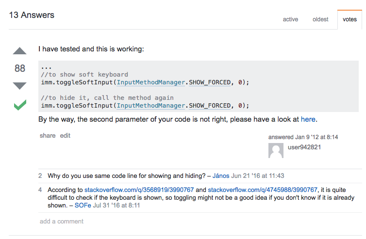
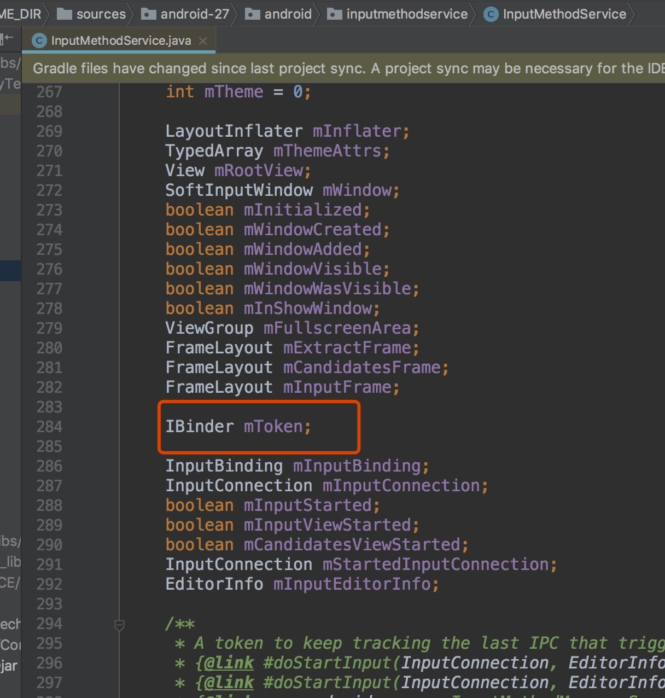
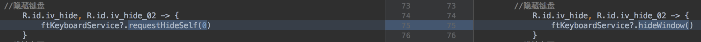

# 自定义输入法和键盘 02

## 输入法问题处理

### 01.键盘无法收起
在低版本手机上 调用了InputMethodService 的showWindow(true) 方法显示键盘后 键盘无法收起和弹出
https://stackoverflow.com/questions/8785023/how-to-close-android-soft-keyboard-programmatically



修改原代码

     ftKeyboardService?.showWindow(true)
 为

       val imm = FTApplication.app.getSystemService(Context.INPUT_METHOD_SERVICE) as InputMethodManager
       imm.toggleSoftInput(InputMethodManager.SHOW_FORCED, 0)

实际上问题并没有解决 这个方法只在输入法app内部可以调出键盘,在其他应用调键盘不出来

```
最终解决方案
// QTIP: 2018/6/20 此方法在fancy以外的应用无效
// val imm = FTApplication.app.getSystemService(Context.INPUT_METHOD_SERVICE) as InputMethodManager
                        // imm.toggleSoftInput(InputMethodManager.SHOW_FORCED, 0)
                        if (Build.VERSION.SDK_INT < Build.VERSION_CODES.O) {
                            //qtip 使用键盘的Token弹出键盘 可行
                            //// QTIP: 2018/6/21  模拟器测试 android P 无效
                            val imm = FTApplication.app.getSystemService(Context.INPUT_METHOD_SERVICE) as InputMethodManager
                            imm.showSoftInputFromInputMethod(FTKeyboardService.ftKeyboardService?.mIBinder, 0)
                        } else {
                            //qtip 测试 -> 此方法在android 6.0已近以下无效 且会导致键盘无法收回
                            ftKeyboardService?.showWindow(true)
                        }
                        
```

关于showSoftInputFromInputMethod传入的第一个参数 
在 自定义继承于 InputMethodService的类中 获取



反射获取 mToken(用于在Android6.0以及以下弹出输入法)

        //反射获取 IBinder(用于在Android6.0以及以下弹出输入法)
        try {
            val clazz = Class.forName("android.inputmethodservice.InputMethodService")
            val declaredField = clazz.getDeclaredField("mToken")
            declaredField.isAccessible = true
            mIBinder = declaredField.get(ftKeyboardService) as IBinder
        } catch (e: Exception) {
            Logger.i(e)
        }
### 02.键盘无法收起 高版本Android 键盘收起时动画问题



```
ftKeyboardService?.requestHideSelf(0)
```

改为
```
ftKeyboardService?.hideWindow()
```
